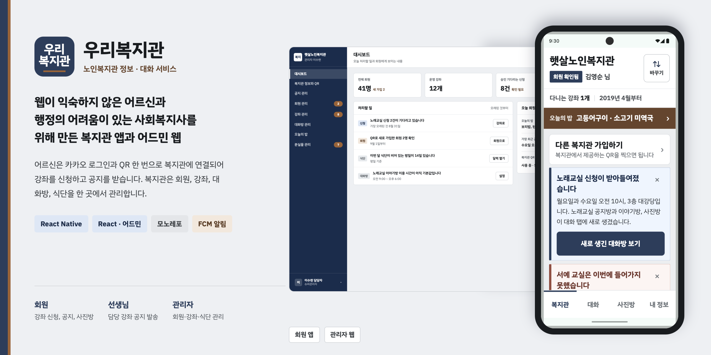

# 노인복지관 프로젝트

> v1(2023.11 ~ 2024.02, 서울 노인복지관 정보 제공 웹앱) 리드미는 [`v1-final` 태그](https://github.com/sjuhan123/senior-welfare-center/blob/v1-final/README.md)에서 볼 수 있습니다.

## 📌 프로젝트 소개

노인복지관 회원(어르신)과 복지관 종사자를 연결하는 모바일 앱과 어드민 웹입니다. 두 가지 문제를 풉니다.

- **정보 접근성**: 어르신들이 복지관 소식과 강좌 정보를 앱에서 바로 확인할 수 있게 합니다.
- **종사자 업무 가중 개선**: 복지관 종사자들이 사적인 카카오톡으로 공지·문의를 처리하며 겪는 부담을, 복지관 공식 소통 채널로 흡수합니다.

회원 인증은 카드 사진 제출 후 수동 승인 방식 대신, **QR 발급 방식**을 택했습니다. 복지관 관리자가 QR을 발급·게시하면 회원은 앱에서 스캔만 하면 되고, 서버는 QR 유효성만 검증해 즉시 자동 승인합니다. 사람이 매 건 검토할 필요가 없어 "자동 승인"과 "종사자 업무 부담 완화" 두 목표를 동시에 만족합니다. QR 유출은 관리자가 주기적으로 재발급하면 기존 QR이 자동 무효화되는 방식으로 관리합니다.

가입 이후에는 카카오톡과 비슷한 구조의 대화방(복지관 공지방, 강좌 공지방, 강좌 이야기방, 강좌 사진방)을 통해 복지관·강좌 소식을 받아보고, 강좌 신청·분실물 확인 등을 앱 안에서 처리할 수 있습니다.

## 🛠 기술 스택

모노레포(Yarn Workspaces) 안에 4개 패키지로 구성되어 있습니다.

### `packages/mobile` (회원용 모바일 앱)

- React Native(Expo), TypeScript
- React Navigation(bottom-tabs, native-stack)
- TanStack Query, Jotai
- 카카오 로그인(`@react-native-seoul/kakao-login`), `expo-camera`(QR 스캔)

### `packages/admin` (복지관 관리자용 웹)

- React, TypeScript, Vite
- Emotion

### `packages/api` (백엔드)

- Node.js, Express
- MongoDB, Mongoose
- Jest, Supertest

### `packages/common` (공유 디자인 토큰)

- 색상/타이포그래피 등 mobile·admin이 공유하는 디자인 토큰

### 인프라 (목표 아키텍처)

- **AWS EC2 + Docker 블루-그린 무중단 배포**: Nginx가 활성 포트로 트래픽을 라우팅하고, 배포 시 비활성 포트에 새 컨테이너를 띄워 헬스체크 후 전환
- **MongoDB**: 개발계/운영계 DB 분리
- **S3**: 사진방 이미지 저장(트래픽 증가 시 도입 예정)
- **Expo Push Service**: 공지방 등 푸시 알림
- **Socket.IO**: 대화 탭 실시간 채팅
- **GitHub Actions**: `dev`/`main` 브랜치별 개발계·운영계 자동 배포
- **도메인 + HTTPS**: `uri-bokji.com`, Let's Encrypt

현재는 재개발 초기 단계라 위 항목 중 일부는 아직 구현 전입니다.
