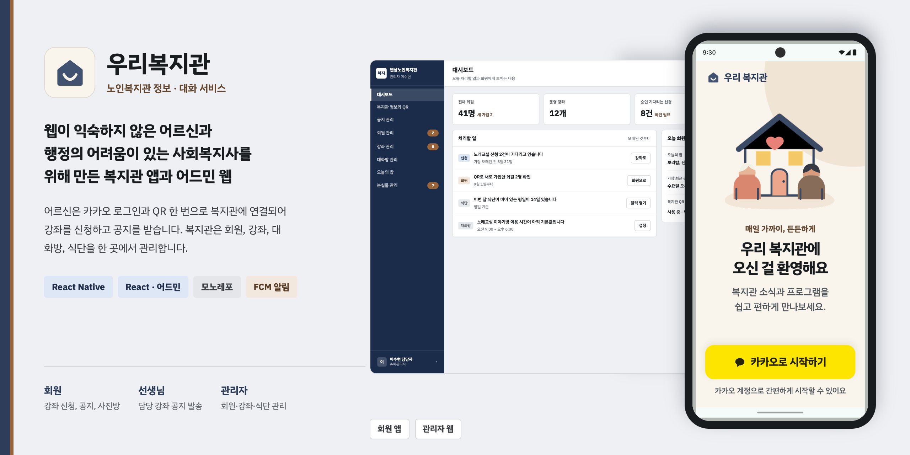

# 노인복지관 프로젝트

> v1(2023.11 ~ 2024.02, 서울 노인복지관 정보 제공 웹앱) 리드미는 [`v1-final` 태그](https://github.com/sjuhan123/senior-welfare-center/blob/v1-final/README.md)에서 볼 수 있습니다.

## 📌 프로젝트 소개

노인복지관 회원(어르신)과 복지관 종사자를 연결하는 모바일 앱과 어드민 웹입니다. 두 가지 문제를 풉니다.

- **정보 접근성**: 어르신들이 복지관 소식과 강좌 정보를 앱에서 바로 확인할 수 있게 합니다.
- **종사자 업무 가중 개선**: 복지관 종사자들이 사적인 카카오톡으로 공지와 문의를 처리하며 겪는 부담을, 복지관 공식 소통 채널로 흡수합니다.

회원 인증은 카드 사진 제출 후 수동 승인 방식 대신, **QR 발급 방식**을 택했습니다. 복지관 관리자가 QR을 발급해서 게시하면 회원은 앱에서 스캔만 하면 되고, 서버는 QR 유효성만 검증해 즉시 자동 승인합니다. 사람이 매 건 검토할 필요가 없어 "자동 승인"과 "종사자 업무 부담 완화" 두 목표를 동시에 만족합니다. QR 유출은 관리자가 주기적으로 재발급하면 기존 QR이 자동 무효화되는 방식으로 관리합니다.

가입 이후에는 카카오톡과 비슷한 구조의 대화방(복지관 공지방, 강좌 공지방, 강좌 이야기방, 강좌 사진방)을 통해 복지관과 강좌 소식을 받아보고, 강좌 신청, 분실물 확인 등을 앱 안에서 처리할 수 있습니다. 강좌 사진방은 사진 여러 장과 글을 올리고 좋아요, 댓글, 공유를 지원하며, 하단 탭의 사진방에서는 가입한 강좌들의 사진을 한 화면에 모아볼 수 있습니다.

## 🛠 기술 스택

모노레포(Yarn Workspaces) 안에 4개 패키지로 구성되어 있습니다.

### `packages/mobile` (회원용 모바일 앱)

- React Native(Expo), TypeScript
- React Navigation(bottom-tabs, native-stack)
- TanStack Query, Jotai
- 카카오 로그인(`@react-native-seoul/kakao-login`), `expo-camera`(QR 스캔)
- `socket.io-client`(대화방 실시간 메시지, 좋아요, 댓글)
- `expo-image-picker`(사진 선택), `expo-sharing`/`expo-file-system`(사진 공유)

### `packages/admin` (복지관 관리자용 웹)

- React, TypeScript, Vite
- Emotion

### `packages/api` (백엔드)

- Node.js, Express
- MongoDB, Mongoose
- Socket.IO(대화방 실시간 메시지, 좋아요, 댓글)
- AWS S3(presigned URL 방식 사진 업로드, 메시지 사진과 프로필 사진에 사용)
- Jest, Supertest

### `packages/common` (공유 디자인 토큰)

- 색상/타이포그래피 등 mobile과 admin이 공유하는 디자인 토큰

### 인프라

구현된 것

- **Socket.IO**: 대화방 실시간 메시지, 좋아요, 댓글
- **S3**: presigned URL 방식으로 메시지 사진, 프로필 사진 업로드
- **AWS EC2 + Docker + GitHub Actions + 블루그린 무중단 배포**: `dev`/`main` 브랜치에 PR이 머지되면 각각 개발계/운영계로 자동 배포. 배포마다 비활성 포트에 새 컨테이너를 띄워 헬스체크 통과 후 nginx가 전환하는 방식이라 다운타임 없음
- **MongoDB 개발계/운영계 DB 분리**: 같은 Atlas 클러스터 안에서 환경별로 별도 DB 사용
- **도메인 + HTTPS**: `uri-bokji.com`/`dev.uri-bokji.com`, Let's Encrypt 인증서 적용

예정인 것

- **Expo Push Service**: 공지방 등 푸시 알림
